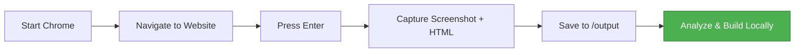

<div align="center">


# 🚀 Ultimate Frontend

### **Clone Any Website. Build Locally. No Paid Tools Needed.**

**Stop paying for Lovable, v0, or other UI cloning services.** Capture any website's design and recreate it in your own codebase—for free.

[](https://opensource.org/licenses/MIT)
[](https://nodejs.org/)
[](http://makeapullrequest.com)

[Quick Start](#-quick-start-2-commands) · [Features](#-why-ultimate-frontend) · [Documentation](#-how-it-works) · [Examples](#-use-cases)

</div>

---

## 🎯 **What is Ultimate Frontend?**

**Ultimate Frontend** is a free, open-source CLI tool that lets you:

- 📸 **Capture screenshots** of any website
- 📄 **Extract HTML source code** instantly
- 🔓 **Bypass bot detection** by using your real Chrome browser
- 🌐 **Access authenticated pages** (Gmail, Twitter, private dashboards)
- 💰 **Save money** on expensive UI cloning services

**Perfect for:**
- Frontend developers building landing pages
- Designers analyzing competitor UIs
- Developers learning from production code
- Teams documenting design systems
- Anyone who wants to clone a website design **without paying monthly subscriptions**

---

## ✨ **Why Ultimate Frontend?**

<table>
<tr>
<td width="50%">

### ❌ **Paid Tools (Lovable, v0)**
- 💸 $20-$100/month subscriptions
- ⏱️ Limited captures per month
- 🔒 Locked into their ecosystem
- 🤖 Often blocked by bot detection
- ☁️ Cloud-based (privacy concerns)

</td>
<td width="50%">

### ✅ **Ultimate Frontend**
- 🆓 **100% Free & Open Source**
- ♾️ **Unlimited captures**
- 🔧 **Full control over your workflow**
- 🧠 **Bypasses bot detection** (uses real Chrome)
- 🏠 **Runs locally** (your data stays private)

</td>
</tr>
</table>

---

## 🚀 **Quick Start (2 Commands)**

### **Installation**

```bash
npm install
```

That's it! Chromium (~200MB) downloads automatically.

---

### **Run It**

<details open>
<summary><b>🔥 Method 1: Real Chrome (Recommended - No Bot Detection)</b></summary>

<br>

**Use this to capture authenticated sites like Gmail, Twitter, or private dashboards.**

```bash
# Terminal 1: Start Chrome with debugging
npm run chrome:debug
```

```bash
# Terminal 2: Run Ultimate Frontend
npm run dev inspect
```

**First time?** The script copies your Chrome profile (~1 min). This gives you all your logged-in sessions!

</details>

<details>
<summary><b>⚡ Method 2: Fresh Browser (Fastest - Public Sites Only)</b></summary>

<br>

**Use this for public websites that don't require login.**

```bash
npm run dev inspect --no-cdp
```

</details>

---

### **Capture Your First Website**

1. Browser opens automatically
2. Navigate to any website (e.g., `stripe.com`, `linear.app`)
3. Press **`Enter`** in the terminal to capture
4. Files saved to `output/` folder:
   - `screenshot-2026-03-19T12-34-56.png`
   - `page-2026-03-19T12-34-56.html`
5. Press **`Enter`** again for more captures
6. Press **`Ctrl+C`** to quit

---

## 💡 **Use Cases**

<table>
<tr>
<td width="33%" align="center">

### 🏗️ **Build Landing Pages**
Clone Stripe, Linear, or any landing page design. Extract HTML/CSS and customize locally.

</td>
<td width="33%" align="center">

### 🔍 **Analyze Competitors**
Study how top companies structure their UIs. Learn best practices from production code.

</td>
<td width="33%" align="center">

### 📚 **Document Design Systems**
Capture component states, responsive layouts, and design patterns for your team.

</td>
</tr>
</table>

**Real Examples:**
- 🎨 Clone Stripe's pricing page → Customize for your SaaS
- 🧩 Capture Linear's dashboard → Learn component structure
- 📱 Screenshot Airbnb's mobile view → Study responsive design
- 🔐 Capture your Gmail inbox → Debug layout issues

---

## 🛠️ **How It Works**



**Under the hood:**
1. Connects to Chrome via **Chrome DevTools Protocol (CDP)**
2. Uses **Playwright** for automation
3. Bypasses bot detection by using your **real browser profile**
4. Extracts full-page screenshots + HTML source
5. Saves timestamped files (never overwrites)

---

## 🎓 **Commands & Options**

### **Basic Usage**

```bash
# Blank browser (navigate manually)
npm run dev inspect

# Open specific URL
npm run dev inspect --url https://stripe.com

# Use fresh browser (no CDP)
npm run dev inspect --no-cdp
```

### **Advanced Options**

| Option | Description | Example |
|--------|-------------|---------|
| `-u, --url <url>` | Open specific URL | `--url https://example.com` |
| `--no-cdp` | Launch fresh browser (may trigger bot detection) | `--no-cdp` |

---

## 📂 **Output Structure**

```
output/
├── screenshot-2026-03-19T10-30-45-123Z.png  ← Full-page screenshot
├── page-2026-03-19T10-30-45-123Z.html       ← Complete HTML source
├── screenshot-2026-03-19T10-35-22-456Z.png  ← Another capture
└── page-2026-03-19T10-35-22-456Z.html       ← Another HTML
```

**Each capture gets a unique timestamp. Never overwrites files.**

---

## 🔥 **Why Use Real Chrome (CDP)?**

<table>
<tr>
<th>Feature</th>
<th>Fresh Browser (--no-cdp)</th>
<th>Real Chrome (CDP)</th>
</tr>
<tr>
<td>Bot Detection</td>
<td>❌ Often blocked</td>
<td>✅ Bypassed</td>
</tr>
<tr>
<td>Logged-In Sessions</td>
<td>❌ No access</td>
<td>✅ Full access</td>
</tr>
<tr>
<td>Gmail/Twitter/Private Sites</td>
<td>❌ Won't work</td>
<td>✅ Works perfectly</td>
</tr>
<tr>
<td>Extensions & Bookmarks</td>
<td>❌ None</td>
<td>✅ All available</td>
</tr>
<tr>
<td>Setup Time</td>
<td>⚡ Instant</td>
<td>🕐 ~1 min (first time only)</td>
</tr>
</table>

**TLDR:** Use CDP for authenticated sites. Use `--no-cdp` for quick public site captures.

---

## 🆚 **Ultimate Frontend vs. Paid Alternatives**

| Feature | Ultimate Frontend | Lovable | v0 | Builder.io |
|---------|-------------------|---------|-----|------------|
| **Price** | 🆓 Free | 💸 $20/mo | 💸 $20/mo | 💸 $50/mo |
| **Captures/Month** | ♾️ Unlimited | 50-100 | 100 | 200 |
| **Local/Cloud** | 🏠 Local | ☁️ Cloud | ☁️ Cloud | ☁️ Cloud |
| **Bot Detection** | ✅ Bypassed | ❌ Often blocked | ❌ Often blocked | ⚠️ Sometimes blocked |
| **Authenticated Sites** | ✅ Yes | ❌ No | ❌ No | ⚠️ Limited |
| **Open Source** | ✅ Yes | ❌ No | ❌ No | ❌ No |
| **Privacy** | 🔒 Your machine | ☁️ Their servers | ☁️ Their servers | ☁️ Their servers |

---

## 🚨 **Troubleshooting**

<details>
<summary><b>"Chrome not running with remote debugging"</b></summary>

<br>

**Fix:**
```bash
npm run chrome:debug
```

This closes your current Chrome and starts a debugging-enabled version.

</details>

<details>
<summary><b>"Sites still detect me as a bot"</b></summary>

<br>

1. Verify you're using **Method 1** (CDP)
2. Check for message: `"✓ Connected to your real Chrome browser"`
3. If it says `"Launching fresh browser"`, CDP failed
4. Refresh your profile:
   ```bash
   rm -rf ~/.chrome-with-debugging && npm run chrome:debug
   ```

</details>

<details>
<summary><b>"Need to refresh my login sessions"</b></summary>

<br>

The Chrome profile is copied **once** on first run. To update:

```bash
rm -rf ~/.chrome-with-debugging
npm run chrome:debug
```

</details>

<details>
<summary><b>"Browser doesn't open"</b></summary>

<br>

Install Chromium manually:

```bash
npx playwright install chromium
```

</details>

---

## 🗺️ **Roadmap**

- [ ] 🧩 **AI-powered component detection** (navbar, hero, footer)
- [ ] 📊 **Generate design system docs** (colors, fonts, spacing)
- [ ] 🎨 **Extract CSS styles** automatically
- [ ] ⚛️ **Generate React/Vue components** from captured UIs
- [ ] 🌐 **Browser extension** for one-click captures
- [ ] 🔌 **Plugin system** for custom analyzers
- [ ] 🐧 **Linux/Windows support** (currently macOS only)

**Want a feature?** [Open an issue!](https://github.com/yourusername/ultimate-frontend/issues)

---

## 🤝 **Contributing**

We love contributions! Here's how to get started:

1. **Fork** this repository
2. **Clone** your fork: `git clone https://github.com/yourusername/ultimate-frontend.git`
3. **Create a branch**: `git checkout -b feature/amazing-feature`
4. **Make changes** and test locally
5. **Commit**: `git commit -m 'Add amazing feature'`
6. **Push**: `git push origin feature/amazing-feature`
7. **Open a Pull Request**

**Ideas for contributions:**
- Add Windows/Linux support
- Improve screenshot quality
- Add CSS extraction
- Build component detection
- Write tests

---

## 📋 **Requirements**

- **Node.js** 16 or higher ([Download](https://nodejs.org/))
- **macOS** (Linux/Windows support coming soon)
- **~200MB** disk space for Chromium

---

## 📜 **License**

This project is licensed under the **MIT License** - see the [LICENSE](LICENSE) file for details.

**TLDR:** You can use this for anything—personal projects, commercial projects, whatever. Just keep the license notice.

---

## 🙏 **Acknowledgments**

Built with:
- [Playwright](https://playwright.dev/) - Browser automation
- [Commander.js](https://github.com/tj/commander.js/) - CLI framework
- Chrome DevTools Protocol - Connecting to real Chrome

---

## 💬 **Support & Community**

- 🐛 **Found a bug?** [Open an issue](https://github.com/yourusername/ultimate-frontend/issues)
- 💡 **Have an idea?** [Start a discussion](https://github.com/yourusername/ultimate-frontend/discussions)
- ⭐ **Like this project?** Give it a star!
- 🐦 **Share on Twitter** with `#UltimateFrontend`

---

## 👨‍💻 **Author**

**mr_code**

Building tools to make frontend development easier and more accessible.

---

<div align="center">

### **Stop Paying for UI Cloning. Start Building for Free.**

**Clone any website. Build locally. Own your workflow.**

[Get Started](#-quick-start-2-commands) · [Star on GitHub ⭐](https://github.com/yourusername/ultimate-frontend)

---

Made with ❤️ for the frontend community

**If this tool saved you money, consider giving it a ⭐**

</div>
